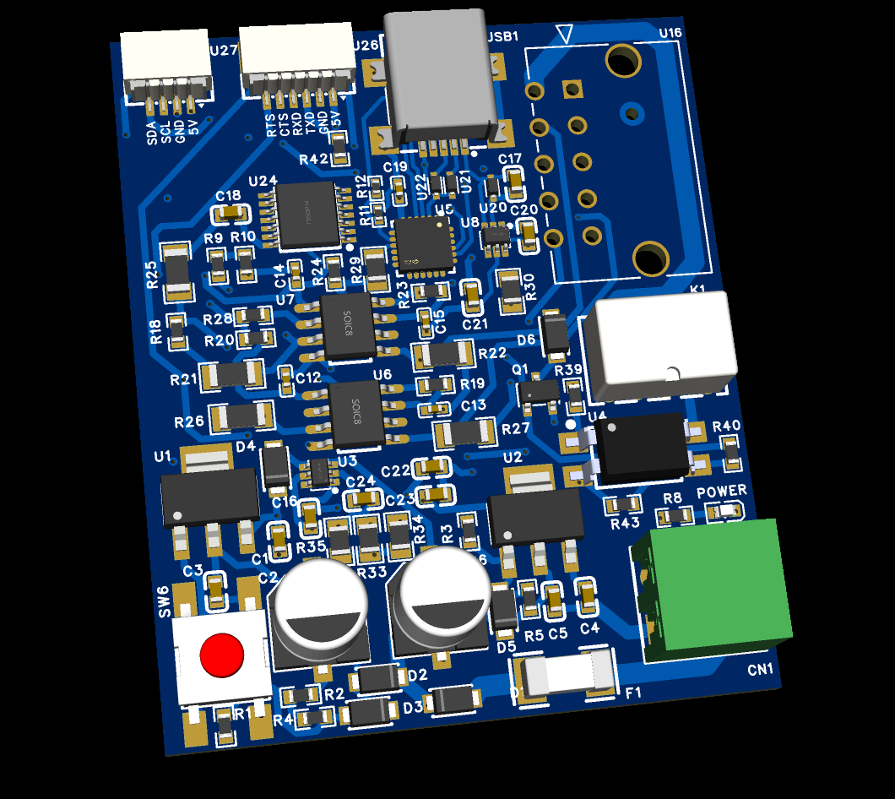

# Zigbee Communication System with XBee3 and ESP32



## Description

This project implements an advanced wireless communication system using XBee3 modules with MicroPython, integrated with an ESP32 for cellular connectivity and remote MQTT. The system enables remote control of IoT devices (such as cameras) through a Zigbee network, with a physical telemando equipped with an OLED screen and buttons for intuitive navigation.

## Main Features

### 1. LCD Telemando (TELEMANDO_LCD)
- **Physical Interface**: 128x64 pixel OLED SSD1306 screen with menu navigation.
- **Controls**: Three buttons (UP, OK, DOWN) for navigation and command execution.
- **Functions**:
  - Remote device selection (cameras).
  - Command sending: Turn camera on/off, request reports.
  - Display of battery status, confirmation messages, and errors.
- **Optimization**: Ultra-fast button response (1ms polling) with asynchronous LCD updates to avoid blocking.

### 2. Zigbee Coordinator (COORD)
- **Central Role**: Manages the Zigbee network as a coordinator.
- **Asynchronous Communication**: Receives reports from remote devices and forwards them to the ESP32 via TTL.
- **ESP32 Requests**: Processes commands for reports or camera control, sending them to remote devices and returning responses.
- **Database**: Maintains a record of connected devices with battery and activity information.

### 3. Remote Devices
- **END_DEVICE**: Final device that responds to telemando commands (e.g., activating/deactivating GPIO for camera control).
- **SENSOR_REMOTO**: Sensor that periodically sends status and battery reports to the coordinator.
- **ROUTER**: Extends the range of the Zigbee network.

### 4. Integration with ESP32 (ESP32_CELULLAR)
- **TTL Communication**: Asynchronous serial interface with the XBee coordinator.
- **Remote MQTT**: Secure connection to an MQTT broker on another local network, using TLS with client certificates.
- **Functions**:
  - Publishes XBee reports to MQTT topics.
  - Receives MQTT commands to send to the XBee (optional).
- **Connectivity**: WiFi for internet access and communication with the remote broker.

### 5. Secure and Efficient Communication
- **TTL Protocol**: Line-based messages (terminated with \n) for XBee-ESP32 communication.
- **MQTT with TLS**: Client-server authentication for secure remote broker access without exposing public ports.
- **Watchdog and Power Management**: WDT on all devices for stability, with low-power modes.

## System Architecture

```
[Telemando LCD] -- Zigbee -- [Coordinator] -- TTL -- [ESP32] -- WiFi -- [Remote MQTT Broker]
                                      |
                                      |-- Zigbee -- [Remote Devices (Cameras/Sensors)]
```

- **Zigbee Network**: Mesh network with XBee3 for reliable wireless communication.
- **ESP32 as a Bridge**: Connects the Zigbee network to the internet/MQTT.
- **Telemando**: Physical user interface for local control.

## Interesting and Innovative Aspects

### 1. **Extreme MicroPython Response Optimization**
- **Ultra-fast Polling**: 1ms for button detection, achieving near-instant response in a constrained environment like XBee3.
- **Logic Separation**: Button detection independent of LCD updates to avoid I2C blocking.
- **Smart Debounce**: Timestamp-based without blocking sleeps, allowing continuous polling.

### 2. **Hybrid Asynchronous Communication**
- **TTL + MQTT**: Combination of asynchronous serial communication with remote MQTT protocol, enabling control from anywhere with internet.
- **TLS Certificates**: Advanced security implementation in MQTT for secure remote access without exposing public ports.

### 3. **Modular and Reusable Architecture**
- **Base Class XBeeDevice**: Inheritance for common devices, with specific subclasses (e.g., Telemand inherits from XBeeDeviceMinimal to optimize memory).
- **Memory Management**: Advanced techniques for MicroPython (lazy imports, forced GC, __slots__) in environments with limited heap.

### 4. **Complete IoT Integration**
- **Remote Camera Control**: From physical telemando to remote MQTT, with bidirectional confirmations.
- **Real-Time Monitoring**: Battery and status reports automatically sent to the MQTT broker.

### 5. **Hardware Optimizations**
- **I2C at 200kHz**: Optimal balance between speed and stability for OLED screen.
- **Smart Watchdog**: Automatic feeding during critical operations to prevent hangs.

## Installation

### Required Hardware:

- XBee3 Zigbee modules (coordinator, router, end devices).
- ESP32 with WiFi module.
- OLED SSD1306 screen, buttons, and battery for telemando.

### Software:

- Install MicroPython on XBee3 via XCTU.
- For ESP32: Use PlatformIO with PubSubClient and WiFiClientSecure libraries.

### Configuration:

- Configure Zigbee addresses in `xbee_devices.py`.
- Adjust WiFi/MQTT credentials in `ESP32_CELULLAR/src/main.cpp`.
- Upload the code to each device.

## Usage

1. **Set Up the Network**: Power on the coordinator and remote devices.
2. **Telemando**: Navigate the menu with buttons to select devices and send commands.
3. **Monitoring**: Reports appear on the remote MQTT broker.
4. **Remote Control**: Send MQTT commands to the ESP32 to control devices via XBee.

This system demonstrates an advanced integration of IoT technologies, optimized for performance and security in embedded environments.